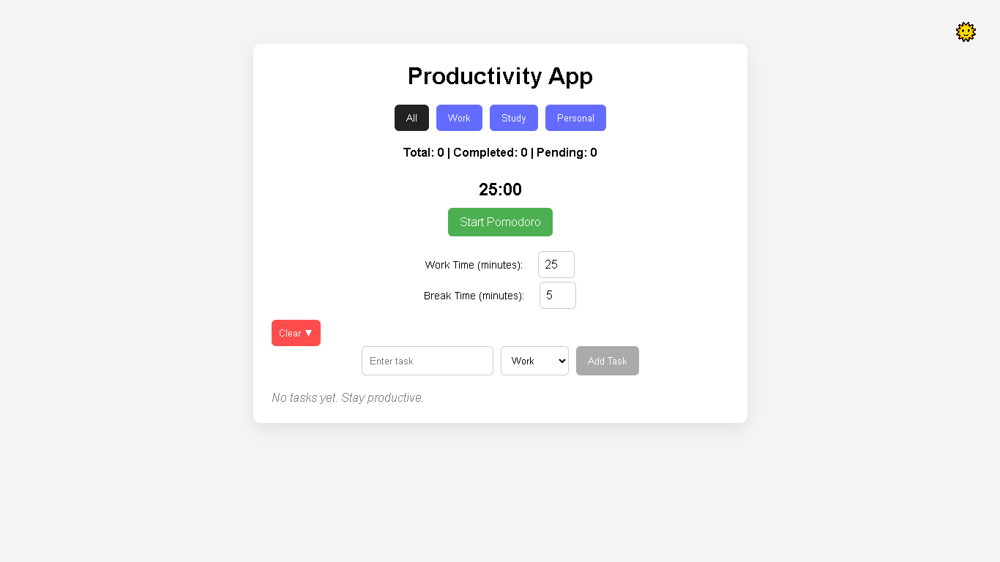
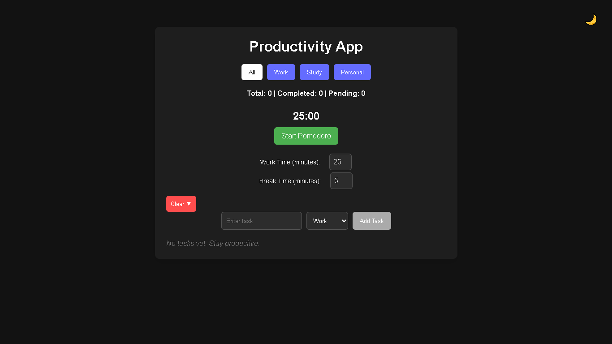

# Personal Productivity Web App

A modern React-based task management application built with Vite.

---

## 🚀 Live Demo

👉 PASTE-YOUR-VERCEL-LINK-HERE

---

## 💻 GitHub Repository

👉 https://github.com/YOUR-USERNAME/productivity-app

---

## ✨ Features

- Add, delete, and complete tasks
- Task categories (Work, Study, Personal)
- LocalStorage persistence
- Category filtering
- Completion metrics
- Clear completed tasks
- Dark / Light mode toggle
- Responsive design (mobile + desktop)
- Smooth animations and transitions

---

## 🛠 Tech Stack

- React (Vite)
- CSS3
- LocalStorage API

---

## 📸 Screenshots

---

## ⚙️ How to Run Locally

npm install  
npm run dev